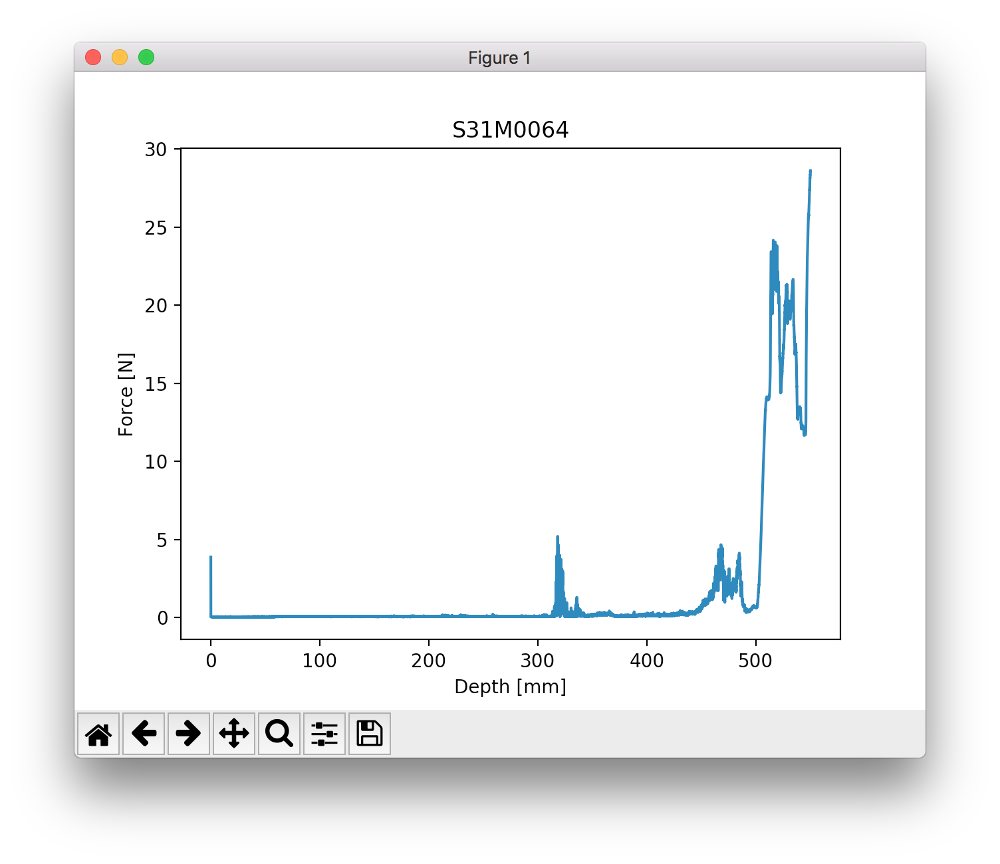

.. _api_usersguide:

API User's Guide
================

Data Files
----------

When performing a measurement with SnowMicroPen, the device writes the data
onto its SD card in a binary file with a :file:`pnt` extension. (Example:
:file:`S13M0067.pnt`). For each measurment process, a new pnt file is written.
Each pnt file consists of a header with meta information followed by the actual
data, the force samples.

.. note:: The *snowmicropyn* package never ever writes into a pnt file. Good to
         know your precious raw data is always save.

Corresponding ini files
^^^^^^^^^^^^^^^^^^^^^^^

However, when using functionality of this package, an additional storage to save
other data is required. This storage is an :file:`ini` file, named like the pnt
file (Example from section before: :file:`S13M0067.ini`).

First steps
-----------

The core class of the API is the :class:`snowmicropyn.Profile` class. It
represents a profile loaded from a pnt file. By using its static load method,
you can load a profile:

.. code-block:: python

   import snowmicropyn
   p = snowmicropyn.Profile.load('./S13M0067.pnt')

In the load call, there's also a check for a corresponding ini file, in this
case for the :file:`S13M0067.ini`.

Logging *snowmicropyn*'s Version and Git Hash
---------------------------------------------

As a scientist, you may interested to keep a log so you can reproduce what you
calculated with what version of *snowmicropyn*. The package contains a version
string and a git hash identifier.

To access the packages version string, you do:

.. code-block:: python

   import snowmicropyn
   v = snowmicropyn.__version__

To access the git hash string of this release, you do:

.. code-block:: python

   import snowmicropyn
   gh = snowmicropyn.githash()

When exporting data using this module, the created CSV files also will contain a
comment as first line with version string and git hash to identify which version
of *snowmicropyn* was used to create the file.

.. warning::

   However, this is no mechanism to protect a file from later alternation. It's
   just some basic information which maybe will be useful to you.

Examples
--------

Some examples will help you to get an overview of *snowmicropyn*'s features.

.. hint::

    You find these and other examples in our collection of
    :github_tree:`examples` on GitHub.

Explore properties
^^^^^^^^^^^^^^^^^^

In our first example, we load a profile and explore its properties. We set some
markers and finally call the :meth:`snowmicropyn.Profile.save` so the markers
get save in a ini file so we don't loose them.

.. literalinclude::  ../examples/explore.py

Batch exporting
^^^^^^^^^^^^^^^

You're just back from back country where you recorded a series of profiles with
your SnowMicroPen and now want to read this data with your tool of choise which
supports reading CSV files? Then this example is for you!

.. literalinclude::  ../examples/batch_export.py

After you executed this example, there will be a :file:`..._samples.csv` and a
:file:`..._meta.csv` for each pnt file in the directory.

Plot using matplotlib
^^^^^^^^^^^^^^^^^^^^^

In this example, we use the delicious matplotlib_ to explore the signal of our
profile.

.. literalinclude::  ../examples/plot.py

A window like to following should open:

Expore using the tool buttons shown! You can even modify the axes and export the
plot into an image file.

.. _matplotlib: https://www.matplotlib.org/
