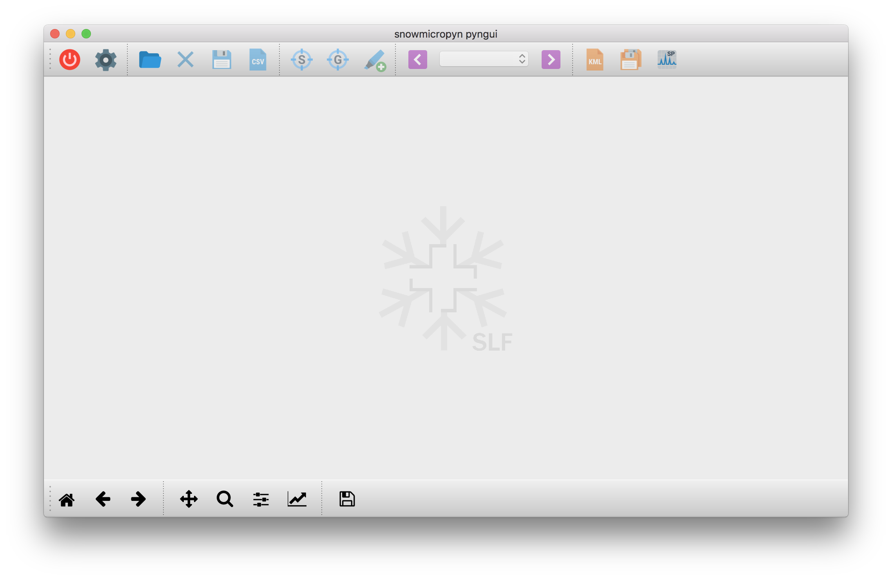

.. _pyngui:

:program:`pyngui`
=================

What is :program:`pyngui`?
--------------------------

:program:`pyngui` is a desktop application to read, visualize and export files
recorded by SnowMicroPen (pnt files).

Launch :program:`pyngui`
--------------------------

When the *snowicropyn* package is installed, a simple script to start
:program:`pyngui` is registered too. Open a Terminal Window and type
:kbd:`pyngui` and hit :kbd:`return`. A window should open which looks like
this screenshot:

Probably, this command fails to launch :program:`pyngui`. Try to launch
it manually then. Type:

.. code-block:: console

   python -m snowmicropyn.pyngui.app

or:

.. code-block:: console

   python3 -m snowmicropyn.pyngui.app

Features & Tips
---------------

Save your changes!
^^^^^^^^^^^^^^^^^^

:program:`pyngui` does not prompt or warn for unsaved changes. Don't forget
to save your markers, otherwise they will be lost.

Loading profiles on startup
^^^^^^^^^^^^^^^^^^^^^^^^^^^

You can load a list of profiles by giving their file paths as command
line arguments:

.. code-block:: console

   python3 -m snowmicropyn.pyngui.app examples/profiles/S37M0876.pnt

Surface & ground
^^^^^^^^^^^^^^^^

:program:`pyngui` uses the marker labels ``surface`` and ``ground`` to mark the
beginning and end of the snowpack. You can let :program:`pyngui` auto-detect
those markers for you by clicking the according icons in the toolbar.

Drift, Offset & Noise
^^^^^^^^^^^^^^^^^^^^^

For each profile, the :program:`pyngui` calculates drift, offset and noise and
displays those values in the sidebar. This data is useful to check for a bad
signal. The values are calculated for a section within the signal. Where this
section starts and ends is indicated in the sidebar. In case you want to specify
the section yourself, set markers called ``drift_begin`` and ``drift_end``. The
simplest way to do so is context clicking into the plot.
